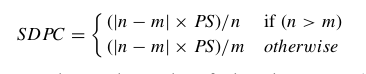

#### Lexical Similarity between two sentences
- ##### Preprocessing
   - Word Tokenize
   - Stemming
   - Lemmatizing
   - Stop Words Removal

- ##### [Levenshtein distance](https://en.wikipedia.org/wiki/Levenshtein_distance) :
   Levenshtein Distance between two words w1 and w2 is number of swaps(insertion,deletion) done to transform one word to another
   - Levenshtein Similarity
```
 LevSimilarity = 1.0 − (LevenshteinDistance(word 1 , word 2 )/maxLength(word 1 , word 2 ))
```
- #####  Path measure :
   - Word net Distance(Path measure) is the distance between the vectors of two words in [wordnet](http://www.nltk.org/howto/wordnet.html) dictionary
```
if Path measure(word 1 , word 2 ) < 0.1 then
   similarity = LevSimilarity(word 1 , word 2 )
else
   similarity = Path measure(word 1 , word 2 )
end if
```  
- ##### Similarity Matrix
 - Generate similarity matrix for two sentences
 - 
- ##### Lexical Similarity Algorithm
```         
matrix = newmatrix(size(A)xsize(B))
 total similarity = 0
 iteration = 0
 for bu i ∈ A do
   for bu  j ∈ B do
     matrix(i, j) = similarity(ti ,tj )
   end for
 end for
 for has line(matrix) and has column(matrix) do
   total similarity = total similarity + larger similarity(matrix)
   remove line(matrix, larger similarity(matrix))
   remove column(matrix, larger similarity(matrix))
   iteration++
 end for
 partial similarity = total similarity/iteration
return partial similarity
```
- ##### Size difference penalization coefficient (SDPC)
 - where n ans m are the number of tokens in sentence 1 and sentence 2
 - 
- ##### Final Similarity
```
Final Similarity = Lexical similarity − SDPC
```
- ##### [DEMO](http://similarity-nlp.greyphase.xyz/)
- [Reference : Assessing sentence similarity through lexical, syntactic and semantic analysis](https://www.sciencedirect.com/science/article/pii/S0885230816000048)
